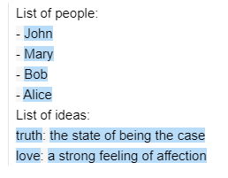
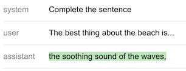
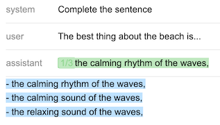
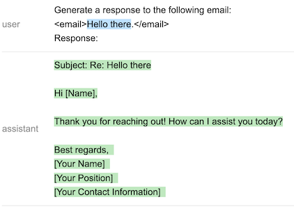
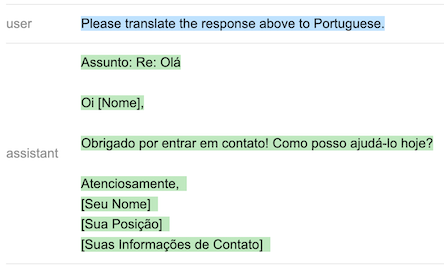

> _Promptitude is a detached fork of <a href="https://github.com/guidance-ai/guidance">Guidance-AI</a> that focuses on template systax and chat completion llms_

<b>Promptitude</b> is a powerful and flexible prompting language framework designed to simplify and enhance interactions with large language models (LLMs). It allows you to create dynamic, template-driven prompts that combine text, logical controls, and variable substitutions, providing fine-grained control over LLM outputs. Promptitude offers an intuitive approach to prompt engineering, particularly suited for rapid prototyping and iterative development of LLM applications. With Promptitude, you can achieve more efficient and effective prompting compared to traditional methods, making it an ideal tool for developers working with LLMs.

# API reference
All of the examples below are in [this notebook](notebooks/tutorial.ipynb).

## Template syntax
The template syntax is based on [Handlebars](https://handlebarsjs.com/), with a few additions.   
When `guidance` is called, it returns a Program:
```python
from promptitude import guidance
prompt = guidance('''What is {{example}}?''')
prompt
```
> What is {{example}}?

The program can be executed by passing in arguments:
```python
prompt(example='truth')
```
> What is truth?

Arguments can be iterables:
```python
people = ['John', 'Mary', 'Bob', 'Alice']
ideas = [{'name': 'truth', 'description': 'the state of being the case'},
         {'name': 'love', 'description': 'a strong feeling of affection'},]
prompt = guidance('''List of people:
{{#each people}}- {{this}}
{{~! This is a comment. The ~ removes adjacent whitespace either before or after a tag, depending on where you place it}}
{{/each~}}
List of ideas:
{{#each ideas}}{{this.name}}: {{this.description}}
{{/each}}''')
prompt(people=people, ideas=ideas)
```


Notice the special `~` character after `{{/each}}`.  
This can be added before or after any tag to remove all adjacent whitespace. Notice also the comment syntax: `{{! This is a comment }}`.

You can also include prompts/programs inside other prompts; e.g., here is how you could rewrite the prompt above:
```python
prompt1 = guidance('''List of people:
{{#each people}}- {{this}}
{{/each~}}''')
prompt2 = guidance('''{{>prompt1}}
List of ideas:
{{#each ideas}}{{this.name}}: {{this.description}}
{{/each}}''')
prompt2(prompt1=prompt1, people=people, ideas=ideas)
```

## Generation
### Basic generation
The `gen` tag is used to generate text. You can use whatever arguments are supported by the underlying model.
Executing a prompt calls the generation prompt:
```python
from promptitude import guidance
# Set the default llm. Could also pass a different one as argument to guidance(), with guidance(llm=...)
guidance.llm = guidance.llms.OpenAI("gpt-4o-mini")
prompt = guidance('''
{{#user~}}
The best thing about the beach is...
{{~/user}}

{{#assistant~}}
{{~gen 'best' temperature=0.7 max_tokens=7}}
{{~/assistant}}
''')
prompt = prompt()
prompt
```
  

`guidance` caches all OpenAI generations with the same arguments. If you want to flush the cache, you can call `guidance.llms.OpenAI.cache.clear()`.

### Generate with `n>1`
If you use `n>1`, the variable will contain a list (there is a visualization that lets you navigate the list, too):
```python
prompt = guidance('''
{{#system~}}
Complete the sentence
{{~/system}}

{{#user~}}
The best thing about the beach is...
{{~/user}}

{{#assistant~}}
{{~gen 'best' n=3 temperature=0.7 max_tokens=7 logprobs=True}}
{{~/assistant}}
''')
prompt = prompt()
prompt['best']
```
> ['the calming rhythm of the waves,',
 'the calming sound of the waves,',
 'the relaxing sound of the waves,']

 ## Calling functions
 You can call any Python function using generated variables as arguments. The function will be called when the prompt is executed:
 ```python
def aggregate(best):
    return '\n'.join(['- ' + x for x in best])
prompt = guidance('''
{{#system~}}
Complete the sentence
{{~/system}}

{{#user~}}
The best thing about the beach is...
{{~/user}}

{{#assistant~}}
{{~gen 'best' n=3 temperature=0.7 max_tokens=7 logprobs=True}}
{{~/assistant}}

{{aggregate best}}
''')
prompt = prompt(aggregate=aggregate)
prompt
```


## Pausing execution with `await`
An `await` tag will stop program execution until that variable is provided:
```python
prompt = guidance('''
{{#user~}}
Generate a response to the following email:
<email>{{email}}.</email>
Response:
{{~/user}}

{{#assistant~}}
{{gen 'response'}}
{{~/assistant}}

{{#user~}}
{{await 'instruction'}}
{{~/user}}

{{#assistant~}}
{{gen 'updated_response'}}
{{~/assistant}}
''', stream=True)
prompt = prompt(email='Hello there')
prompt
```


Notice how the last `gen` is not executed because it depends on `instruction`. Let's provide `instruction` now:

```python
prompt = prompt(instruction='Please translate the response above to Portuguese.')
prompt
```


The program is now executed all the way to the end.
